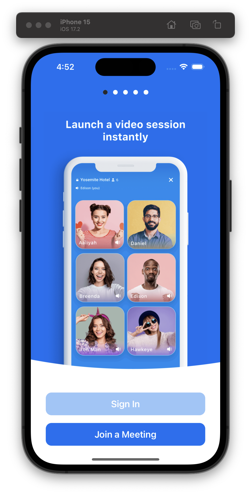

# React Native Zoom SDK UI Kit

## Description

This is a custom zoom.us UI Kit designed for React Native projects. It provides the fundamental setup and structure to facilitate the integration of the Zoom SDK into your React Native project. Please note that this UI Kit is not an official release.

## Prerequisites

Before you begin, ensure you have the following installed:

- Java 11
- Node.js 16.18.2 or above
- npm or yarn (package manager)
- Android Studio (for Android development)
- Xcode 14.2 or above (for iOS development)

## Getting Started

1. **Clone the repository:**

   ```bash
   git clone https://github.com/rohan3342/react-native-zoom-sdk-UI-Kit.git
   ```

2. **Navigate to the project folder:**

   ```bash
    cd react-native-zoom-sdk-UI-Kit
   ```

3. **Install dependencies:**

   ```bash
   yarn install or npm install
   ```

4. **Pod Install for iOS:**

   ```bash
   yarn ios:pods or npx pod-install
   ```

5. **Run the application:**

- For iOS:
  ```bash
    yarn ios
  ```
- For Android:
  ```bash
    yarn android
  ```

6. **Please make following changes:**
   - Add your `ZOOM_APP_KEY`
   - Add your `ZOOM_APP_SECRET`
   - Pass the `jwtToken` while join the call.
   - For more details follow [this](https://developers.zoom.us/docs/video-sdk/react-native/get-started/) document.

## Folder Structure

```lua
|-- android
|-- ios
|-- node_modules
|-- src
    |-- assets
    |-- components
    |-- hooks
    |-- navigation
    |-- screens
    |-- styles
    |-- utils
    |-- App.js
|-- .gitignore
|-- .node-version
|-- app.json
|-- babel.config.js
|-- index.js
|-- metro.config.js
|-- package.json
|-- README.md
```

## App Screenshots

[Android Build Link](https://install.appcenter.ms/users/rohan.singh-tothenew.com/apps/zoom-ui-kit/distribution_groups/public)

{ width=50% height=50% }
{ width=50% height=50% }
{ width=50% height=50% }
{ width=50% height=50% }
{ width=50% height=50% }
{ width=50% height=50% }
{ width=50% height=50% }
{ width=50% height=50% }
